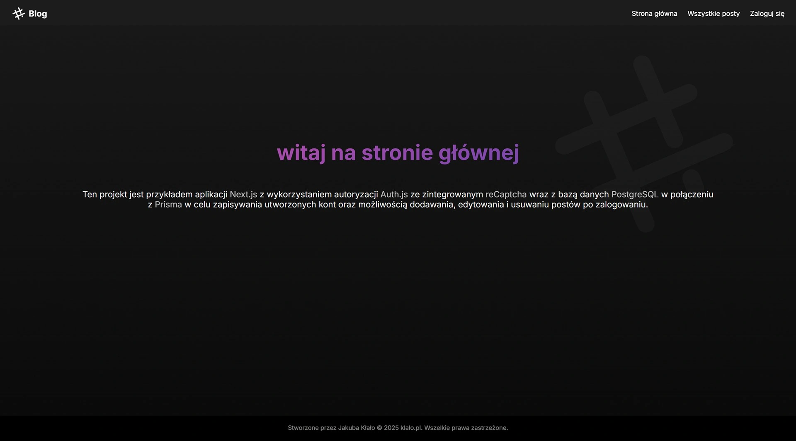

<h1>Blog</h1>

<div>
  
  
  
  
  
  
  
  
  
  
  
  
  
  
  
</div>

<br />

<div>
  <p>Fullstack blog application created using Next.js v14 framework with connection to PostgreSQL Database using Prisma for user login/register server account authentication.</p>

  <ul>
    <li>Using <a href="https://nextjs.org/docs/14/getting-started">Next.js</a> framework with App Router ( /app )</li>
    <li>Build by <a href="https://pnpm.io/">pnpm</a> package manager</li>
  </ul>
</div>

<br />

<!--  -->

<h2>At first run:</h2>

Create new `.env` file and fill it in according to [example template](./example.env).

<br />

Install all packages and required dependencies:

```
pnpm install
```

generate new prisma client:

```
npx prisma generate
```

migrate prisma database:

```
npx prisma migrate dev
```

run whole project as dev:

```
pnpm dev
```

in every change in database and prisma scheme run:

```
pnpm exec prisma db push
```

<h2>Features:</h2>

<ul>
  <li>dynamically updating database content in real time</li>
  <li>register and login forms with client and server validation</li>
  <li>toast responsive prompts</li>
  <li>adding, editing and deleting posts on blog page with saving to database</li>
  <li>dedicated profile page for changing password, deleting account or log out from session</li>
  <li>view of all of user posts and comments</li>
</ul>

<h2>Support:</h2>

<a href="https://ko-fi.com/quanosek">
  
</a>
